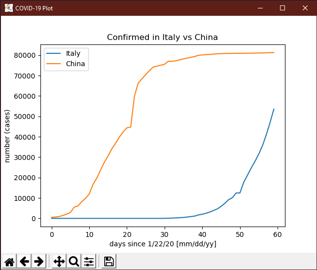

# COVID-19-Plot

This small script automatically downloads all the latest COVID-19 data from the [2019 Novel Coronavirus COVID-19 (2019-nCoV) Data Repository by Johns Hopkins CSSE](https://github.com/CSSEGISandData/COVID-19), lets you choose a country and/or province and plots the data for you. Additionally, you can also save a csv file with the chosen data and some more info (see below).



## Install

First of all, you need Python 3 for this to work.

```bash
#Clone git repository
git clone https://github.com/Phoenix1747/COVID-19-Plot.git

#Change directory
cd COVID-19-Plot

#Install dependencies
pip3 install -r requirements.txt

#Execute script
python3 covid_plot.py
```

## Config

Use python3 to use this script as usual. More info:

```bash
usage: covid_plot.py [-h] [-np] [-l] [-f FILE] -c COUNTRY [-p PROVINCE] [-cy CATEGORY]

Plot the latest COVID-19 data based on country and province/state.

optional arguments:
  -h, --help            show this help message and exit
  -np, --no-plot        do not plot the data
  -l, --log             plot logarithmic axis
  -f FILE, --file FILE  print data to this file
  -c COUNTRY, --country COUNTRY
                        specify country as in data. If you provide multiple country flags this
                        will go into comparison mode.
  -p PROVINCE, --province PROVINCE
                        specify province in the chosen country
  -cy CATEGORY, --category CATEGORY
                        specify a category [confirmed, deaths,recovered]
```

Notes:

- You can choose from 3 categories: Confirmed cases [Confirmed], deaths [Deaths] and recoveries [Recovered].
- Countries and provinces are taken directly from the data csv and in order to get the correct datapoint you have to know the exact country name as in the csv and at least part of the province name (not case sensitive). This can be a bit tricky for a couple of countries. Example: Looking for `South Korea` will result in an error, instead look for `Korea, South` (again, not case sensitive). Have a look at these files: [COVID-19 time series](https://github.com/CSSEGISandData/COVID-19/tree/master/csse_covid_19_data/csse_covid_19_time_series)
- You can choose to print the data results to a (csv) file like the original data file. Additionally you will also get the following info:
  - Third line: Day-to-day delta of cases.
  - Fourth line: Ratio of delta(day n)/delta(day n-1)
